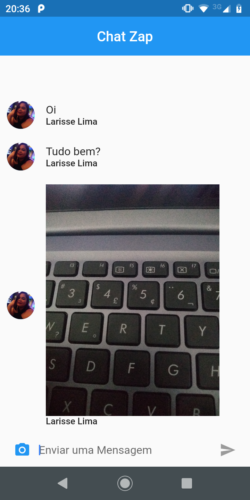

<h1 align="center">Chat</h1>


<h2 align="center">Tópicos 📋</h2>

   <p>
   
   - [Sobre 📖](#sobre-)
   - [Preview 📱](#preview-)
   - [Funcionalidades 🛠️](#Funcionalidades-%EF%B8%8F)
   - [Como Rodar 🤔](#como-usar-)
   - [Como Contribuir 💪](#como-contribuir-)
   - [Licença 📝](#licença-)

   </p>

---

<h2 align="center">Sobre 📖</h2>
   
<p align="center">
   Chat foi criado para treino com firebase, Realtime Database.<br>
  
</p>

---

<h2 align="center">Preview 📱</h2>

   <p align="center">
      
   </p>

---


<h2 align="center">Funcionalidades 🛠️</h2>

   <p>
   
- Envio de mensagens
    - Login com o Google,
    - Imagem de perfil do usuário,
    - Envio de imagens,
     
   </p>

---

<h2 align="center">Como Rodar 🤔</h2>

   ```
   First of all, correctly configure the Flutter development environment on your machine,
   see https://flutter.dev/docs/get-started/install
   
   - Clone this repository:
   $ git clone https://github.com/LarisseLima/chat_firebase

   - Enter in directory:
   $ cd chat

   - For install dependencies:
   $ flutter pub get

   - Run the app: 
   $ flutter run
   ```

---

<h2 align="center">Como Contribuir 💪</h2>

   ```
   - Fork o projeto 

   - Cria uma nova branch com suas mudanças:
   $ git checkout -b my-feature

   - Salve suas mudanças e crie uma mensagem de commit falando o que fez:
   $ git commit -m "feature: My new feature"

   - Envie suas mudanças:
   $ git push origin my-feature
   ```

---

<h2 align="center">Licença 📝</h2>

<p align="center">
   Este repositório está sob licença MIT. Você pode ver o arquivo <a href="">LICENSE</a> para mais detalhes. 😉
</p>

   ---

   >Esse projeto foi desenvolvido com ❤️ por **[@Larisse Lima](https://www.linkedin.com/in/larisselima/)**
  

---

 
